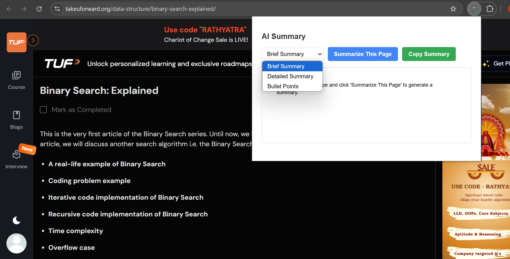
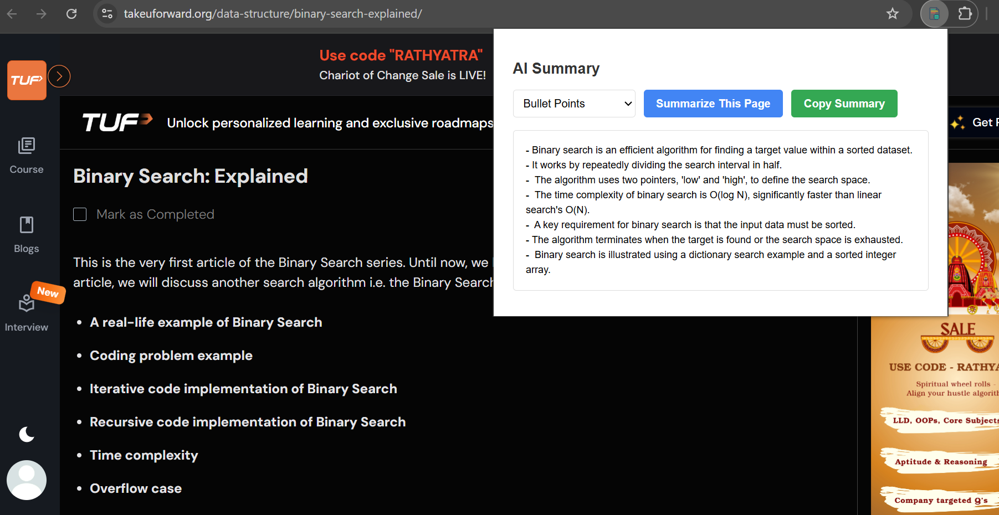

# AI Summarizer 🧠⚡

**AI Summarizer** is a Chrome extension that intelligently summarizes any web page's content using the **Gemini API**. It helps you digest long articles faster by offering three flexible summary formats:

- 📝 **Detailed** – In-depth and comprehensive summary
- 🔹 **Bullet Points** – Key takeaways in a list
- ✂️ **Brief** – Short and concise overview

The extension is accessed through a simple popup, making it quick and non-intrusive while browsing.

## ✨ Features

- Summarize any web page instantly
- Choose between **Brief**, **Detailed**, or **Bullet Points**
- Powered by Gemini AI for high-quality summaries
- Clean popup UI for fast access
- Copy summary with a single click

## 📸 Screenshots

### 🔽 Summary Type Selection

### 🔹 Bullet Point Summary Example

---

> Built with 💻 JavaScript, HTML, CSS, and Gemini API
